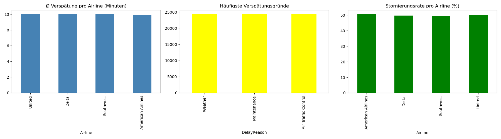

# ✈️ Flight Delay Analyzer

Analysis of flight delays using Python and Pandas.

## What this project does
- Analyzes average delay per airline
- Identifies most common delay reasons
- Compares cancellation rates across airlines

## Technologies
Python · Pandas · Matplotlib · NumPy

## Results

